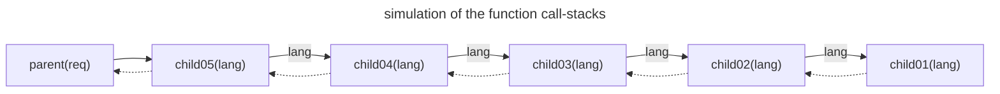
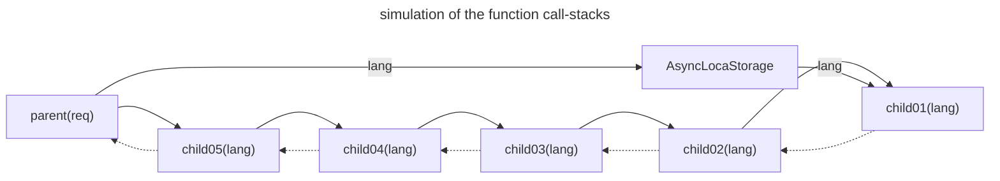

## Background

This document introduces the [AsyncContext](https://github.com/tc39/proposal-async-context) feature. AsyncContext is a feature in TC39 [Stage2](https://tc39.es/process-document/). I introduce it because it has been included in the Node.js environment since v12 and continues to be improved in versions like v16, v18, v20, etc.

When running a synchronous function, creating a context before running the function allows the function to maintain and utilize the context while it runs. Synchronous functions can utilize the context because no other functions are executed while it is executed, so the value of the context can be guaranteed if the executing function does not change it, but asynchronous functions cannot guarantee the value of the context because other functions may be executed. Therefore, it is inconvenient to keep passing values such as tracking id, request id, etc. for tracking or settings such as language, cache life cycle, etc. as arguments to the function.

```ts
const Polyglot = require('node-polyglot');

const polyglot = {
  ko: new Polyglot({
    phrases: {
      hello_name: '안녕하세요! %{name}님',
    },
  }),
  en: new Polyglot({
    phrases: {
      hello_name: 'Hola %{name}',
    },
  }),
};

function child01(lang: string) {
  return polyglot[lang].t('hello_name', { name: 'hello' });
}

function child02(lang: string) {
	return { message: child01(lang) };
}
function child03(lang: string) {
	return child02(lang);
}
function child04(lang: string) {
	return child03();
}
function child05(lang: string) {
	return child04(lang);
}

function parent(req: FastifyRequest) {
  const lang = req.headers['accpet-language'];
	const message = child05(lang);
	return { ...message, id: 1 };
}
```

In the example above, the parent function uses the child05 function to get the message value, but the child05 function actually runs several other functions to get the message.



In the example code above, you can see that child02, child03, child04, and child05 don't use the language argument value, but the lang value is still passed as an argument to the child01 function to pass the language value. However, we can easily change this structure by utilizing context.

```ts
const { AsyncLocalStorage, AsyncResource } = require('async_hooks');
const store = new AsyncLocalStorage();
const Polyglot = require('node-polyglot');

const polyglot = {
  ko: new Polyglot({
    phrases: {
      hello_name: '안녕하세요! %{name}님',
    },
  }),
  en: new Polyglot({
    phrases: {
      hello_name: 'Hola %{name}',
    },
  }),
};

async function child01() {
  const currentStore = store.getStore();
  console.log('language: ', currentStore.lang);
  return polyglot[currentStore.lang].t('hello_name', { name: 'hello' });
}

async function child02() {
  return { message: await child01() };
}
async function child03() {
  return child02();
}
async function child04() {
  return child03();
}
async function child05() {
  return child04();
}

async function parent(req) {
  const lang = req.headers['accpet-language'];

  const result = store.run({ lang }, async () => {
    const resource = new AsyncResource('fastify-async-context');
    return resource.runInAsyncScope(async () => {
      const message = await child05(lang);
      return { ...message, id: 1 };
    });
  });

  return result;
}
```

In this example, unlike before, you can see that the lang value is not passed as an argument to the child01, child02, child03, child04, and child05 functions. Even though it is not passed as an argument, you can see that the child01 function uses AsyncContext to read the language value.



You can expect to be more productive and better able to utilize a variety of data because you won't have to keep passing AsyncContext the information it needs as function arguments.

## Case study of AsyncContext

I'm going to describe in more detail my experience using AsyncContext in a useful way. However, browsers don't support AsyncContext yet, so we have to use alternatives like [zone.js](https://www.npmjs.com/package/zone.js). So let's take a look at how we can utilize AsyncContext in a Node.js environment.

### Request ID & Tracking ID

Giving every request a unique ID is useful for analyzing problems in case of failures, bugs, etc. fastify.js provides the ability to generate Request IDs.

```ts
const tidSymbol = Symbol('tid')
const fastify = require('fastify');
const server = fastify({ 
  genReqId: (req) => {
    const tid = randomUUID();
    req[tidSymbol] = tid;
	return tid;
} });
```

The request is now given a unique UUID, and once we have this UUID, we can track the request. Let's make it a little more useful. Store the UUID in the AsyncContext.

```ts
const fastify = require('fastify');
const { AsyncResource, executionAsyncId } = require('async_hooks');
const  { fastifyRequestContext } = require('@fastify/request-context');
const crypto = require('crypto');

const tidSymbol = Symbol('fastify-request-context-tracking-id')
const resourceType = 'fastify-request-context';

// Create fastify server with request ID generator
const server = fastify({ 
  genReqId: (req) => {
    const tid = crypto.randomUUID();
    req[tidSymbol] = tid;
    return tid;
  } 
});

server.register(fastifyRequestContext, {
  defaultStoreValues: (req) => ({
    tid: req.id,
    lang: req.headers['accept-language'],
    type: resourceType,
    triggerAsyncId: executionAsyncId(),
  }),
  createAsyncResource: () => new AsyncResource(resourceType),
});
```

Now we can access `req.id` from every fastify request handlers, and use `AsyncContext` in other functions to extract the request ID.

### TypeORM with AsyncContext

[TypeORM](https://typeorm.io/) is a library that allows various databases to be used in the Node.js environment. ORM libraries provide the ability to log the queries they execute. TypeORM also provides the feature to log all queries, slow queries, query errors, and more. Combining the logging features with the Request ID mentioned earlier makes for a useful log.

```ts
import { AbstractLogger } from "typeorm"

export class MyCustomLogger extends AbstractLogger {
  /**
   * Write log to specific output.
  */
  protected writeLog(
        level: LogLevel,
        logMessage: LogMessage | LogMessage[],
        queryRunner?: QueryRunner,
    ) {
        // implementation of writeLog ...
	}
	
	/**
   * Logs query that is slow.
   */
  logQuerySlow(time: number, query: string, parameters?: unknown[], _queryRunner?: QueryRunner) {
    if (isFalse(this.isLogEnabledFor('query-slow'))) {
      return;
    }

	  const store = getAsyncStore();
	  console.log(`[${store.tid ?? randomUUID()}][${time}]show query: `, query, parameters);
  }
}
```

The example above logs the slow query with a tid, where tid is the `request.id` you stored in AsyncLocalStorage before. This allows you to quickly track which APIs are causing the slow queries, and is useful for planning fixes by knowing how often your APIs are being called.

### translate with AsyncContext

I use the i18n library to create multilingual messages. I use [node-polyglot](https://www.npmjs.com/package/node-polyglot), which requires me to decide which language to use before using the translate function. To determine the language, I have to keep passing the language to different functions, as mentioned in the background, and this is where AsyncContext can be used to simplify the process.

### getAsyncStore 함수

We've seen situations where it's useful to use AsyncContext, so let's see how we can get AsyncLocalStorage. There are two ways you can get AsyncLocalStorage. The first way is to use Hooks to create a copy of the AsyncResource when it is created and destroyed. This approach is explained in [Getting per-request context in NodeJS with async_hooks
](https://blog.besson.co/nodejs_async_hooks_to_get_per_request_context/). The second method is to use `executionAsyncResource`.

```ts
import { executionAsyncResource } from 'node:async_hooks';
import { randomUUID } from 'node:crypto';

export function getAsyncStore(): { [key: string]: unknown } {
  const acquiredExecutionAsyncResource = executionAsyncResource() as {
    [key: string | symbol]: unknown;
  };
  const keys = Object.getOwnPropertySymbols(acquiredExecutionAsyncResource);
  const store = keys
    .map((key) => acquiredExecutionAsyncResource[key])
    .find((element): element is { tid: string } => typeof element === 'object' && element != null);

  if (store?.tid == null) {
    return `unde${randomUUID().substring(4)}`;
  }

  return store.tid;
}
```

You can use the `Object.getOwnPropertySymbols` function to extract the key of the AsyncResource, and that way you can get the AsyncLocalStorage. It doesn't matter which method you choose, but in my personal experience, the first method sometimes doesn't retrieve the AsyncLocalStorage, so if you want it to work every time, I recommend using the second method.

## Conclusion

AsyncContext is still in Stage 2, and if you look at the official Node.js [reference documentation](https://nodejs.org/api/async_hooks.html), each version has a slightly different implementation, so it may be difficult to use if you are using Node.js v16 or lower. Also, the specification may change because it is in Stage 2. Nevertheless, AsyncContext is attractive. It's very useful to be able to get a common value from somewhere without having to add all the arguments to a function, so if you're building a new environment or using Node.js v16 or later, you should definitely take a look at it. Thank you for reading the documentation so far!
