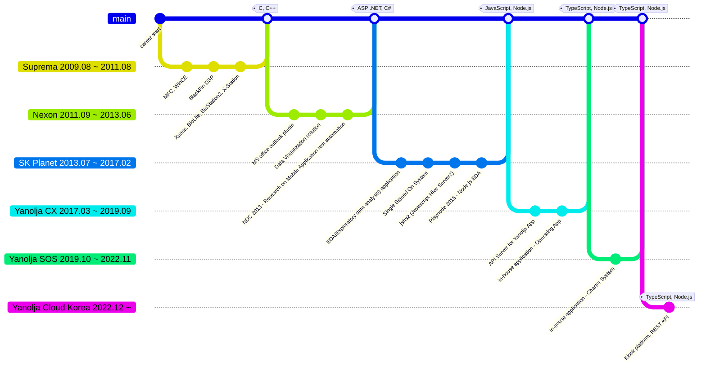

## Career Summary

TypeScript, JavaScript full-stack developer. I started out in firmware development. I developed firmware for various hardware using C/C++, MFC, etc. and then switched careers and started developing web and web servers using ASP.NET C#, WinForm, etc. Currently, I am developing REST APIs using TypeScript, Node.js, and have been in charge of performance improvement and design to handle large traffic. I am also continuously researching and applying code automation, static analysis, and documentation automation to write high-quality code in limited time.

## Education

### Kyungsung University

> `1999 ~ 2006`

- Computer Science Beachelor's degree

### Pusan National University

> `2007 ~ 2009`

- Computer Engineering Master's degree

## Work Experience

### Summary

### Yanolja Cloud Korea

> Kiosk Server Team `2023.01 ~`

Served as development leader and system design and development on a project to convert offline kiosks to cloud kiosks. Developed using TypeScript, Fastify.js, and Node.js, and applied Hexagonal Architecture for scalability. Delivered a quality product within a limited timeframe and received good reviews at the 2023 Hotel Show, especially improving customer satisfaction by reducing the complexity of the check-in procedure and increasing processing speed. Communication between servers was done via REST API and AmazonMQ, and ElastiCache was used to handle large amounts of traffic. MySQL RDS was used for data management.

- Kiosk Server Team
  - Team leader, Node.js & TypeScript Tech Leader
- Kiosk Platform Architecture Design
  - Backend
    - Storage
      - RDS(Aurora MySQL, MySQL), ElastiCache, ElasticSearch (in AWS)
      - TypeORM
    - Tech Stack
      - TypeScript, Node.js
      - Jest, Vitest test framework
      - Webpack, ESBuild
      - Fastify.js
      - Swagger.io, TypeDoc, JSONSchema with ajv

### SOS Dept. in Yanolja

> Seller Office Service Dept. `2019.10 ~ 2022.12`

Served as development lead and system design and development on a back-office development project to support a new business. Developed using TypeScript, Fastify.js, and Node.js, and applied Hexagonal Architecture for scalability. The Charter Product Management system integrates inventory data from multiple sites to efficiently manage them in one place, and uses REST APIs and AmazonMQ, Kafka to manage inventory. I also worked to enable the operations team to quickly respond to inventory changes through a Slack application. The frontend was developed with Next.js with SSR support, and the REST API server was developed with Fastify.js. I used MySQL RDS and ElastiCache for data management and developed an MSA architecture to integrate with multiple internal REST APIs.

- Seller Office Service Dept.
  - Team leader, Node.js & TypeScript Tech Leader
- Charter System, in-house application Architecture Design
  - A integrated system for accommodation inventory across apps
  - Backend
    - Storage
      - RDS(Aurora MySQL, MySQL), ElastiCache, ElasticSearch (in AWS)
      - TypeORM
    - Tech Stack
      - TypeScript, Node.js
      - Jest, Ava test framework
      - Webpack, Just, NPM scripts
      - Fastify.js
      - Swagger.io, TypeDoc, JSONSchema: ajv
  - Frontend in-house Application
    - Tech Stack
      - TypeScript, Next.js, React
      - SASS, Styled-Components, @emotion/css
      - React Hook, Jotai, Recoils
      - Websocket: socket.io

### CX Dept. in Yanolja

> Customer eXperience Dept. `2017.03 ~ 2019.09`

In this project, I was responsible for designing and developing a Backend For Frontend (BFF) REST API server for the Yanolja app. The project was developed in TypeScript, Express.js, and Node.js and utilized AWS Beanstalk to automatically scale up and down the server. The BFF REST API system is an API server through which all traffic of the Yanolja app passes, and I applied a scalable architecture for handling large traffic volumes and designed and developed a cache system. I also developed a batch server to add a new business, leisure product inventory, and designed and developed Yanolja app product search API and product detail API.

- Customer eXperience Dept.
  - Node.js & TypeScript Tech Leader
- Mobile App Client Backend For Frontend (BFF) REST API
  - Backend
    - Infra
      - AWS beanstalk
      - aws-cli, beanstalk cli
    - Tech Stack
      - TypeScript, Node.js
      - TypeDoc, JSONSchema: ajv
      - Webpack, Gulp
      - Express, Redis(using Elasticache)
  - Frontend
    - Web Site Product Manager
      - React, Next.js SSR
      - Webpack, SASS, CSS

### SK Planet

> BigData Analysis Dept. `2013.07 ~ 2017.02`

I was responsible for the design and development of a back-office system that utilized big data infrastructure to help analyze data. The project developed the backend using JavaScript, Express.js, and Node.js, and the frontend using Angular.js v1 and Bootstrap. The system was developed to register user queries using Hive Server2 and show query execution results in excel format, and to extract various data by registering various input values to user queries and changing these values to real time. The system was also developed to periodically execute user pre-registered queries and record the results in different tables.

- BigData Analysis Dept.
  - Node.js & JavaScript Developer
- Exploratory Data Analysis(EDA) application
  - Custom Stored Procedures for Hive Server2
    - Customizing Stored Procedure parameters
  - a Batch Query Execution System for Hive Server2
  - Backend
    - Storage
      - MySQL, Hive Server2
      - Sequelize
    - Tech Stack
      - thrift protocol
        - JSHS2 (Javascript Hive Server2)
        - Hive Server2 (v0.13.x ~ v1.x)
      - JavaScript, Node.js
      - Express.js
  - Frontend
    - Tech Stack
      - Gulp, Webpack
      - Angular.js v1, jQuery, Bootstrap
      - 2D grid like Excel style
      - SASS, Jade
- Single Sign On(SSO)
  - oAuth2 (AuthCode type oAuth2)
  - Provide integrated Authentication & Authorization platform for another system
  - Support compliance issue for EDA System

### Nexon

> ITSM Dept. `2011.09 ~ 2013.06`

I was responsible for design and development in a project to develop a back-office system to help analyze data using MS SQL Server. The project developed the backend with ASP .NET MVC C#, Windows Server Services, and the frontend with jQuery, Bootstrap. Mobile games require a lot of data analysis at the time of launch, and to quickly extract business information, I developed a system to register user queries and show the execution results in excel format tables and charts. I also developed a system to record the work done by the support department through an office plug-in instead of through a web browser.

- ITSM Dept.
  - Web Developer
- Data Visualization application
  - Custom Stored Procedures for SQL Server
    - Customizing Stored Procedure parameters
  - a Batch Query Execution System for SQL Server
  - Storage
    - MS SQL Server
    - Dapper
  - Backend
    - Tech Stack
      - ASP .NET C#
  - Frontend
    - Bootstrap, jQuery
    - Support chart using D3
      - eg. line, bar, pie, st acked bar, etc
- MS Office Outlook Plugin
  - Human Resource, Task management plugin
  - Backend
    - WCF HTTP Service
  - Frontend
    - C# WinForm

### Suprema Inc

> BioStar Sector Dept. `2009.08 ~ 2011.09`

Responsible for firmware development and maintenance for the BioStar family of products. Participated in the development of new products, BioStation2 and X-Station, and developed the BioEntry iCLASS derivative.

- BioStar Sector Dept.
  - Firmware developer
- WinCE platform Embedded system
  - MFC, WinCE, C++
  - BioStation2, X-Station
- BlackFin DSP platform Embedded system
  - C, C++
  - Xpass, BioLite, BioEntry iClass

## Technical Projects

### Conference Speaker

- NDC 2013
  - [NDC MonkeyRunner를 이용한 모바일 테스트 자동화](https://www.slideshare.net/ssuser735f04/ndc-2013-monkeyrunner)
- Playnode 2015
  - [Node.js를 사용한 Big Data 사례 연구](https://www.slideshare.net/ssuser735f04/nodejs-big-data-61442290)

### OpenSource

- [ctix](https://github.com/imjuni/ctix)
  - CLI to generate index.ts file for webpack, rollup entrypoint
- [create-ts-index](https://github.com/imjuni/create-ts-index)
  - CLI to generate index.ts file for webpack, rollup entrypoint
- [erdia](https://github.com/imjuni/erdia)
  - CLI to generate ER diagram using mermaid.js, TypeORM entity
- [jin-frame](https://github.com/imjuni/jin-frame)
  - Library to define REST API Spec. using TypeScript Type, Decorator, Class

## Skill

### Programming Language

1. JavaScript, TypeScript
1. C#, C++, C
1. Go
1. PHP, Java, Rust

### Frameworks

- Fastify.js, Express.js
- TypeORM, Prisma, Sequelize.js
- React.js, Next.js
- Angular v1, jQuery, Bootstrap
- webpack, rollup, esbuild
- jest, vitest, ava

### DevOps

- Git, Jira, Confluence

### Data System

- MySQL, Hive
- Redis
- Kafka, RabbitMQ, ActiveMQ

### Infra

- Docker
- AWS
  - ElasticBeanstalk, S3, ElastiCache, AWS RDS, CloudFront, CloudWatch

## References

- [Github](https://github.com/imjuni)
- [Homepage](https://imjuni.github.io/imjuni)
- [Linkedin](https://www.linkedin.com/in/byungjoon-lee-26030370/)
