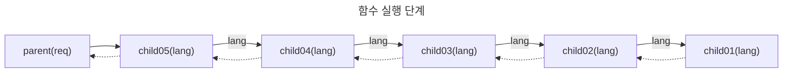
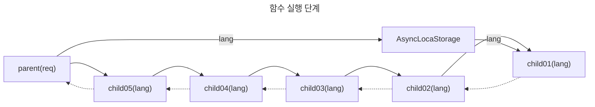

## Background

이 문서는 AsyncContext 기능을 소개합니다. [AsyncContext](https://github.com/tc39/proposal-async-context)는 TC39 [Stage2](https://tc39.es/process-document/) 단계에 있는 기능입니다. Node.js 환경에서는 v12부터 포함되어 있었고 v14 ~ v20 등의 버전에서 안정적으로 동작하고 있기 때문에 소개합니다.

동기식 함수를 실행할 때는 함수를 실행하기 전 컨텍스트를 생성하면 함수가 실행하는 동안 컨텍스트를 유지하고 활용할 수 있습니다. 동기식 함수는 실행되는 동안 다른 함수가 실행되지 않기 때문에 컨텍스트를 실행 함수가 변경하지 않는다면 값을 보장할 수 있어서 컨텍스트를 활용할 수 있지만 비동기식 함수는 다른 함수가 실행될 수 있어서 컨텍스트 값을 보장할 수 없습니다. 그래서 추적을 위한 tracking id, request id 등의 값이나 language, cache life cycle 등의 설정을 함수의 인자로 계속 전달 해야하는 불편함이 있습니다.

```ts
function child01(lang: string) {
	return translate('greeting', { lang });
}

function child02(lang: string) {
	return { message: child01(lang) };
}
function child03(lang: string) {
	return child02(lang);
}
function child04(lang: string) {
	return child03();
}
function child05(lang: string) {
	return child04(lang);
}

function parent(req: FastifyRequest) {
  const lang = req.headers['accpet-language'];
	const message = child05(lang);
	return { ...message, id: 1 };
}
```

위 예제를 보면 parent 함수는 child05 함수를 사용해서 메시지 값을 얻습니다. 하지만 실제로 child05함수는 여러차례 다른 함수를 실행해서 메시지를 얻습니다.



위 예제 코드에서 child02, child03, child04, child05는 언어와 관련한 별도의 작업을 하지는 않지만 child01 함수에 언어 값을 전달하기 위해서 lang 값을 계속 인자로 전달 받는 것을 볼 수 있습니다. 하지만 컨텍스트를 활용하면 이런 구조를 간단하게 변경할 수 있습니다.

```ts
const { AsyncLocalStorage, AsyncResource } = require('async_hooks');
const store = new AsyncLocalStorage();
const Polyglot = require('node-polyglot');

const polyglot = {
  ko: new Polyglot({
    phrases: {
      hello_name: '안녕하세요! %{name}님',
    },
  }),
  en: new Polyglot({
    phrases: {
      hello_name: 'Hola %{name}',
    },
  }),
};

async function child01() {
  const currentStore = store.getStore();
  console.log('language: ', currentStore.lang);
  return polyglot[currentStore.lang].t('hello_name', { name: 'hello' });
}

async function child02() {
  return { message: await child01() };
}
async function child03() {
  return child02();
}
async function child04() {
  return child03();
}
async function child05() {
  return child04();
}

async function parent(req) {
  const lang = req.headers['accpet-language'];

  const result = store.run({ lang }, async () => {
    const resource = new AsyncResource('fastify-async-context');
    return resource.runInAsyncScope(async () => {
      const message = await child05(lang);
      return { ...message, id: 1 };
    });
  });

  return result;
}

async function handler() {
  const r = await parent({ headers: { 'accpet-language': 'en' } });
  console.log(r);
}

handler().catch((err) => {
  console.log(err.message);
});
```

이 예제는 이전과 다르게 child01 ~ child05 함수에 별도로 lang 값을 인자로 전달하지 않는 것을 볼 수 있습니다. 인자로 전달하지 않더라도 child01 함수에서 AsyncContext를 사용해서 언어 값을 읽어 오는 것을 볼 수 있습니다.



이와 같이 AsyncContext를 활용하면 생산성을 높일 수 있습니다.

## Why useful AsyncContext?

배경 설명에서 왜 유용한지를 설명했고, 이제 우리는 AsyncContext가 유용할 수 있다는 것을 알았습니다. 그래서 이번에는 제가 정말 유용하게 사용했던 경험을 좀 더 상세하게 설명하려고 합니다. 다만 아직 브라우저는 AsyncContext를 지원하지 않습니다. 그래서 [zone.js](https://www.npmjs.com/package/zone.js)와 같은 대안을 사용해야 합니다. 그래서 Node.js 환경에서 AsyncContext를 어떻게 활용할 수 있는지 알아보겠습니다.

### Request ID & Tracking ID

모든 Request에 고유한 ID를 부여하는 것은 장애, 버그 등이 발생했을 때 문제를 분석하는데 유용합니다. fastify.js는 Request ID를 생성할 수 있는 기능을 제공합니다.

```ts
const tidSymbol = Symbol('tid')
const fastify = require('fastify');
const server = fastify({ genReqId: (req) => {
	const tid = randomUUID();
	req[tidSymbol] = tid;
	return tid;
} });
```

이제 request에 고유한 UUID가 부여되고 이 UUID를 얻으면 request를 추적할 수 있습니다. 좀 더 유용하게 만들어 봅시다. 처음 할 일은 randomUUID() 결과로 얻은 Request ID를 AsyncContext에 저장합니다.

```ts
const fastify = require('fastify');
const { AsyncResource, executionAsyncId } = require('async_hooks');
const  { fastifyRequestContext } = require('@fastify/request-context');
const crypto = require('crypto');

const tidSymbol = Symbol('fastify-request-context-tracking-id')
const resourceType = 'fastify-request-context';

// Server를 생성, Request ID를 crypto.randomUUID로 생성
const server = fastify({ 
  genReqId: (req) => {
    const tid = crypto.randomUUID();
    req[tidSymbol] = tid;
    return tid;
  } 
});

server.register(fastifyRequestContext, {
  defaultStoreValues: (req) => ({
    tid: req.id,
    lang: req.headers['accept-language'],
    type: resourceType,
    triggerAsyncId: executionAsyncId(),
  }),
  createAsyncResource: () => new AsyncResource(resourceType),
});
```

이제 모든 Request Handler에서 request.id에 접근할 수 있고, 다른 함수에서도 AsyncContext를 사용해서 Request ID를 추출할 수 있습니다.

### TypeORM with AsyncContext

TypeORM은 여러가지 데이터베이스를 Node.js 환경에서 사용할 수 있게 해주는 라이브러리입니다. ORM 라이브러리는 실행한 쿼리를 로깅하는 기능을 제공합니다. TypeORM도 모든 쿼리, 슬로우 쿼리, 쿼리 오류 등을 로깅할 수 있는 기능을 제공합니다. 로깅 기능을 앞서 언급한 Request ID와 연결하면 유용한 로그가 됩니다.

```ts
import { AbstractLogger } from "typeorm"

export class MyCustomLogger extends AbstractLogger {
  /**
   * Write log to specific output.
  */
  protected writeLog(
        level: LogLevel,
        logMessage: LogMessage | LogMessage[],
        queryRunner?: QueryRunner,
    ) {
        // implementation of writeLog ...
	}
	
	/**
   * Logs query that is slow.
   */
  logQuerySlow(time: number, query: string, parameters?: unknown[], _queryRunner?: QueryRunner) {
    if (isFalse(this.isLogEnabledFor('query-slow'))) {
      return;
    }

	  const store = getAsyncStore();
	  console.log(`[${store.tid ?? randomUUID()}][${time}]show query: `, query, parameters);
  }
}
```

위 예제는 슬로우 쿼리와 tid를 같이 기록합니다. 이렇게하면 어떤 API에서 슬로우 쿼리가 발생했는지 빠르게 추적이 가능하며 API 호출 빈도를 파악해서 수정 계획을 세울 때 유용합니다.

### translate with AsyncContext

다국어 메시지를 만들때 i18n 라이브러리를 사용합니다. 저는 node-polyglot를 사용하는데, translate 함수를 사용하기 전에 사용할 언어를 결정해야합니다. 언어를 결정하려면 앞서 배경설명에서 언급한 것과 같이 언어를 여러 함수에 계속 전달해야 하는데 이 때 AsyncContext를 사용하면 그런 과정을 간소화 할 수 있습니다.

### getAsyncStore 함수

AsyncContext를 사용했을 때 유용한 상황을 볼 수 있었습니다. 그렇다면 AsyncLocalStorage를 어떻게 얻을 수 있는지 알아봅시다. AsyncLocalStorage를 얻을 수 있는 방법은 두 가지가 있습니다. 첫 번째 방법은 Hook을 사용하여 AsyncResource가 생성, 소멸 될 때 사본을 생성해서 얻는 방법입니다. 이 방법은 [Getting per-request context in NodeJS with async_hooks
](https://blog.besson.co/nodejs_async_hooks_to_get_per_request_context/)에서 확인할 수 있습니다. 두 번째 방법은 `executionAsyncResource`를 사용하는 방법입니다.

```ts
import { executionAsyncResource } from 'node:async_hooks';
import { randomUUID } from 'node:crypto';

export function getAsyncStore(): { [key: string]: unknown } {
  const acquiredExecutionAsyncResource = executionAsyncResource() as {
    [key: string | symbol]: unknown;
  };
  const keys = Object.getOwnPropertySymbols(acquiredExecutionAsyncResource);
  const store = keys
    .map((key) => acquiredExecutionAsyncResource[key])
    .find((element): element is { tid: string } => typeof element === 'object' && element != null);

  if (store?.tid == null) {
    return `unde${randomUUID().substring(4)}`;
  }

  return store.tid;
}
```

`Object.getOwnPropertySymbols` 함수를 사용하면 AsyncResource의 키를 추출할 수 있고, 이 방법으로 AsyncLocalStorage를 얻을 수 있습니다. 어떤 방식을 선택하던 상관 없지만 개인적 경험으로는 첫 번째 방법은 간혹 AsyncLocalStorage를 검색하지 않는 경우가 있어서 항상 잘 동작하는 경우를 원한다면 두 번째 방법을 사용하는 것을 추천합니다.

## 결론

AsyncContext는 아직 Stage2 단계에 있고, Node.js 공식 [레퍼런스 문서](https://nodejs.org/api/async_hooks.html)를 보면 버전 별로 구현한 내용이 조금씩 다릅니다. 그래서 Node.js v16 미만을 사용하는 경우 사용하기 어려울 수 있습니다. 또한 Stage2 단계이기 때문에 스펙이 변경될 수도 있습니다. 그럼에도 불구하고 AsyncContext는 매력적입니다. 최근 fastify.js, express.js의 function handler 또는 RabbitMQ, ActiveMQ, SQS를 사용할 때 producer, comsumer 등은 비동기 함수로 작성하는 경우가 많아서 AsyncContext를 활용하기 좋아졌습니다. 특히 Message Queue를 사용할 때 메시지나 작업하는 작업 과정에 UUID를 부여해서 로그에 기록한다면 역시 유용한 로그를 만들 수 있습니다. 함수의 인자를 일일히 추가하지 않더라도 공통으로 사용할 수 있는 값을 어딘가에서 얻어올 수 있다는 것은 매우 유용하기 때문에 새로운 환경을 구축한다거나 v16 이상의 Node.js를 사용하고 있다면 꼭 한 번 검토해보세요. 감사합니다.