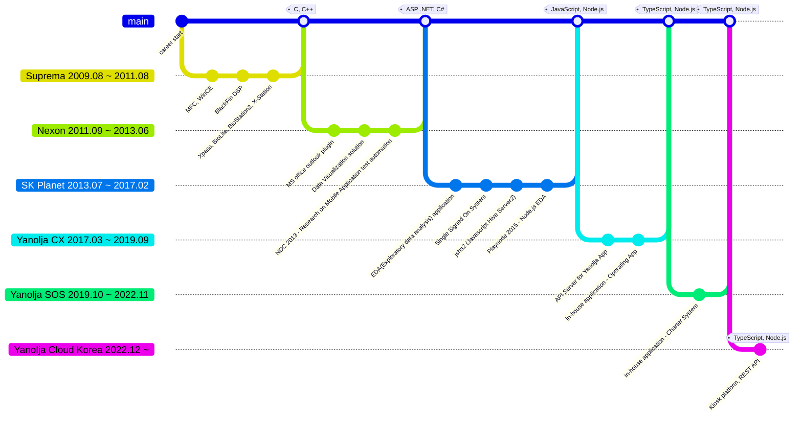

## Career Summary

TypeScript, JavaScript 풀스택 개발자. 첫 이력은 펌웨어 개발로 시작했습니다. C/C++, MFC 등을 사용해서 여러 하드웨어의 펌웨어를 개발했고 이 후 커리어를 전환하여 ASP.NET C#, WinForm 등을 사용하여 웹 사이트 및 웹 서버 개발을 시작했습니다. 현재는 TypeScript, Node.js를 사용하여 REST API를 개발하고 있으며 대규모 트래픽을 소화하기 위한 성능 개선 및 설계 업무를 담당했습니다. 또한 한정된 시간에 높은 품질을 가진 코드를 작성하기 위한 코드 자동 생성 및 정적 분석, 문서 자동화 등에 대해서 꾸준히 연구하고 적용하고 있습니다.

## Education

### Kyungsung University

> 재학기간 `1999 ~ 2006`

- 컴퓨터 과학과 학사학위(Computer Science Beachelor's degree)

### Pusan National University

> 재학기간 `2007 ~ 2009`

- 컴퓨터 공학과 석사(Computer Engineering Master's degree)

## 이력사항

### 요약

### 야놀자 클라우드 코리아

> Kiosk Server 팀 `2023.01 ~`

오프라인 키오스크를 클라우드 키오스크로 전환하는 프로젝트에서 개발 리더 및 시스템 설계 및 개발을 담당했습니다. TypeScript, Fastify.js, Node.js를 사용하여 개발하였으며, 확장 가능성을 고려하여 Hexagonal Architecture를 적용했습니다. 제한된 시간 내 프로젝트를 진행했고 2023년 호텔쇼에 참가하여 좋은 평가를 받았습니다. AWS IoT를 사용하여 키오스크 상태를 모니터링하며 체크인, 체크아웃 정보를 키오스크 플랫폼으로 통합하여 오프라인 키오스크 대비 관리 편의성을 개선하였습니다. 서버 간 통신은 REST API와 AmazonMQ를 통해 이루어졌고, 대량의 트래픽 처리를 위해 ElastiCache를 사용했습니다. 데이터 관리에는 MySQL RDS를 사용했습니다.

- Kiosk Server 팀
  - Team leader, Node.js & TypeScript Tech Leader
- Kiosk Platform Architecture Design
  - Backend
    - Storage
      - RDS(Aurora MySQL, MySQL), ElastiCache, ElasticSearch (in AWS)
      - TypeORM
    - Tech Stack
      - TypeScript, Node.js
      - Jest, Vitest test framework
      - Webpack, ESBuild
      - Fastify.js
      - Swagger.io, TypeDoc, JSONSchema with ajv

### 야놀자 SOS 실

> Seller Office Service(SOS) 실 `2019.10 ~ 2022.12`

신규 비즈니스를 지원하기 위한 백오피스 개발 프로젝트에서 개발 리더 및 시스템 설계 및 개발을 담당했습니다. 이 프로젝트는 TypeScript, Fastify.js, Node.js로 개발했고 확장 가능성을 고려햐여 Hexagonal Architecture를 적용했습니다. 차터 관리자 시스템은 여러 사이트의 재고 데이터를 통합해 한 곳에서 효율적으로 관리할 수 있도록 하며, REST API와 AmazonMQ, Kafka를 사용해 재고 변경을 관리합니다. 또한 운영 팀이 슬랙 어플리케이션을 통해 신속하게 재고 변화에 대응할 수 있도록 작업 하였습니다. 프론트엔드는 SSR을 지원하는 Next.js로 개발하였고, REST API 서버는 Fastify.js로 개발하였습니다. 데이터 관리를 위해 MySQL RDS와 ElastiCache를 사용하고, 사내 여러 REST API와 연동하는 MSA 아키텍처로 개발하였습니다.

- Seller Office Service(SOS) 실
  - Team leader, Node.js & TypeScript Tech Leader
- Charter System, in-house application Architecture Design
  - A integrated system for accommodation inventory across apps
  - Backend
    - Storage
      - RDS(Aurora MySQL, MySQL), ElastiCache, ElasticSearch (in AWS)
      - TypeORM
    - Tech Stack
      - TypeScript, Node.js
      - Jest, Ava test framework
      - Webpack, Just, NPM scripts
      - Fastify.js
      - Swagger.io, TypeDoc, JSONSchema: ajv
  - Frontend in-house Application
    - Tech Stack
      - TypeScript, Next.js, React.js
      - SASS, Styled-Components, @emotion/css
      - React Hook, Jotai, Recoils
      - Websocket: socket.io

### 야놀자 CX 실

> Customer eXperience(CX) 실 `2017.03 ~ 2019.09`

야놀자 앱을 위한 Backend For Frontend(BFF) REST API 서버를 개발 프로젝트에서 설계 및 개발을 담당했습니다. 이 프로젝트는 TypeScript, Express.js, Node.js로 개발했고 AWS Beanstalk를 활용하여 서버 규모를 자동으로 증설/축소 하도록 설계 및 개발하였습니다. BFF REST API 시스템은 야놀자 앱의 모든 트래픽이 거쳐가는 API 서버로, 대용량 트래픽 처리를 위한 확장 가능한 아키텍처를 적용하고 캐시 시스템 설계 개발했습니다. 또한 신규 비즈니스인 레저 상품 인벤토리를 추가하기 위한 배치 서버 개발 및 야놀자 앱 상품 검색 API, 상품 상세 API 등을 설계 개발 하였습니다.

- Customer eXperience(CX) 실
  - Node.js & TypeScript Tech Leader
- Mobile App Client Backend For Frontend (BFF) REST API
  - Backend
    - Infra
      - AWS beanstalk
      - aws-cli, beanstalk cli
      - Redis(Elasticache)
    - Tech Stack
      - TypeScript, Node.js
      - TypeDoc, JSONSchema: ajv
      - Webpack, Gulp
      - Express.js
  - Frontend
    - Tech Stack
      - React.js, Next.js SSR
      - Webpack, SASS, CSS

### SK Planet

> Data Infrastructure(DI) 팀 `2013.07 ~ 2017.02`

빅데이터 인프라를 활용하여 데이터 분석에 도움을 주는 백오피스 시스템 개발 프로젝트에서 설계 및 개발을 담당했습니다. 이 프로젝트는 JavaScript, Express.js, Node.js로 백엔드를 개발했고 Angular.js v1, Bootstrap을 사용하여 프론트엔드를 개발하였습니다. 이 시스템은 Hive Server2를 사용하여 사용자 쿼리를 등록하고 쿼리 실행 결과를 엑셀 형식으로 보여주고 사용자 쿼리에 다양한 입력 값을 등록하고 이 값을 실 시간으로 변경하여 다양한 데이터를 추출할 수 있게 개발하였습니다. 또한 사용자 미리 등록한 쿼리를 주기적으로 실행하며 그 결과를 다른 테이블에 기록하는 등의 시스템도 개발하였습니다.

- Data Infrastructure(DI) 팀
  - Node.js & JavaScript Developer
- Exploratory Data Analysis(EDA) application
  - Custom Stored Procedures for Hive Server2
    - Customizing Stored Procedure parameters
  - a Batch Query Execution System for Hive Server2
  - Backend
    - Storage
      - MySQL, Hive Server2
      - Sequelize.js
    - Tech Stack
      - thrift protocol
        - JSHS2 (Javascript Hive Server2)
        - Hive Server2 (v0.13.x ~ v1.x)
      - JavaScript, Node.js
      - Express.js
  - Frontend
    - Tech Stack
      - Gulp, Webpack
      - Angular.js v1, jQuery, Bootstrap
      - 2D grid like Excel style
      - SASS, Jade
- Single Sign On(SSO)
  - oAuth2 (AuthCode type oAuth2)
  - Provide integrated Authentication & Authorization platform for another system
  - Support compliance issue for EDA System

### Nexon

> ITSM 개발팀 `2011.09 ~ 2013.06`

MS SQL 서버를 사용하여 데이터 분석에 도움을 주는 백오피스 시스템 개발 프로젝트에서 설계 및 개발을 담당했습니다. 이 프로젝트는 ASP .NET MVC C#, 윈도우 서버 서비스로 백엔드를 개발했고 jQuery, Bootstrap을 사용하여 프론트엔드를 개발했습니다. 모바일 게임은 런칭 시점에 데이터 분석이 많이 필요한데 이 때 사업 지표를 빨리 추출할 수 있도록 사용자 쿼리를 등록하고 실행 결과를 엑셀 형식 표와 차트로 보여주는 시스템을 개발하였습니다. 또한 지원 부서에서 작업한 내용을 웹 브라우저를 통하지 않고 오피스 플러그인을 통해서 기록하는 시스템을 개발하였습니다.

- ITSM 개발팀
  - Web Developer
- Data Visualization application
  - Custom Stored Procedures for SQL Server
    - Customizing Stored Procedure parameters
  - a Batch Query Execution System for SQL Server
  - Storage
    - MS SQL Server
    - Dapper
  - Backend
    - Tech Stack
      - ASP .NET C#
  - Frontend
    - Bootstrap, jQuery
    - Support chart using D3
      - eg. line, bar, pie, st acked bar, etc
- MS Office Outlook Plugin
  - Human Resource, Task management plugin
  - Backend
    - WCF HTTP Service
  - Frontend
    - C# WinForm

### Suprema Inc

> BioStar Sector 실 `2009.08 ~ 2011.08`

BioStar 제품군 펌웨어 개발 및 유지보수를 담당했습니다. BioStation2, X-Station 신제품 개발에 참여 하였으며, BioEntry iCLASS 파생모델을 개발했습니다.

- BioStar Sector 실
  - Firmware developer
- WinCE platform Embedded system
  - MFC, WinCE, C++
  - BioStation2, X-Station
- BlackFin DSP platform Embedded system
  - C, C++
  - Xpass, BioLite, BioEntry iClass

## Technical Projects

### Conference Speaker

- NDC 2013
  - [NDC MonkeyRunner를 이용한 모바일 테스트 자동화](https://www.slideshare.net/ssuser735f04/ndc-2013-monkeyrunner)
- Playnode 2015
  - [Node.js를 사용한 Big Data 사례 연구](https://www.slideshare.net/ssuser735f04/nodejs-big-data-61442290)

### OpenSource

- [ctix](https://github.com/imjuni/ctix)
  - CLI to generate index.ts file for webpack, rollup entrypoint
- [create-ts-index](https://github.com/imjuni/create-ts-index)
  - CLI to generate index.ts file for webpack, rollup entrypoint
- [erdia](https://github.com/imjuni/erdia)
  - CLI to generate ER diagram using mermaid.js, TypeORM entity
- [jin-frame](https://github.com/imjuni/jin-frame)
  - Library to define REST API Spec. using TypeScript Type, Decorator, Class

## Skill

### Programming Language

1. JavaScript, TypeScript
1. C#, C++, C
1. Go
1. PHP, Java, Rust

### Frameworks

- Fastify.js, Express.js
- TypeORM, Sequelize.js
- React.js, Next.js
- Angular v1, jQuery, Bootstrap
- webpack, rollup, esbuild
- Jest, Ava

### DevOps

- Git, Jira, Confluence

### Data System

- MySQL, Hive
- Redis
- Kafka, RabbitMQ, ActiveMQ

### Infra

- Docker
- AWS
  - ElasticBeanstalk, S3, ElastiCache, AWS RDS, CloudFront, CloudWatch

## References

- [github](https://github.com/imjuni): `https://github.com/imjuni`
- [site](https://imjuni.github.io/imjuni): `https://imjuni.github.io/imjuni`
- [linkedin](https://www.linkedin.com/in/byungjoon-lee-26030370/): `https://www.linkedin.com/in/byungjoon-lee-26030370/`
